## 细粒度权限控制
### 角色

- role_admin 
- role_user
- role_common

### 用户

- tz   role_admin、role_common
- gf   role_user、role_common

### 资源

- /admin/* 、/customer/view 、/customer/delete
- tz 可以访问任意资源，gf只能访问/customer/view

### keycloak web端配置

#### 创建realm


#### 创建角色

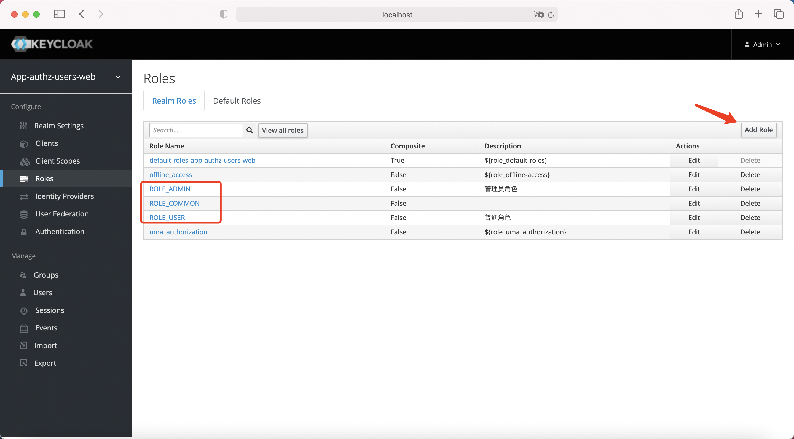

#### 创建用户


#### 给用户指定角色

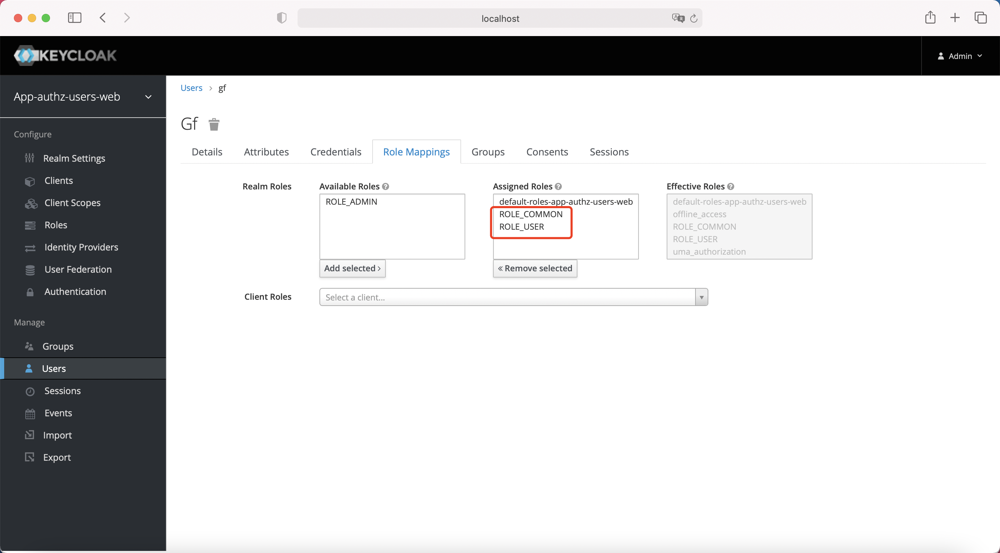
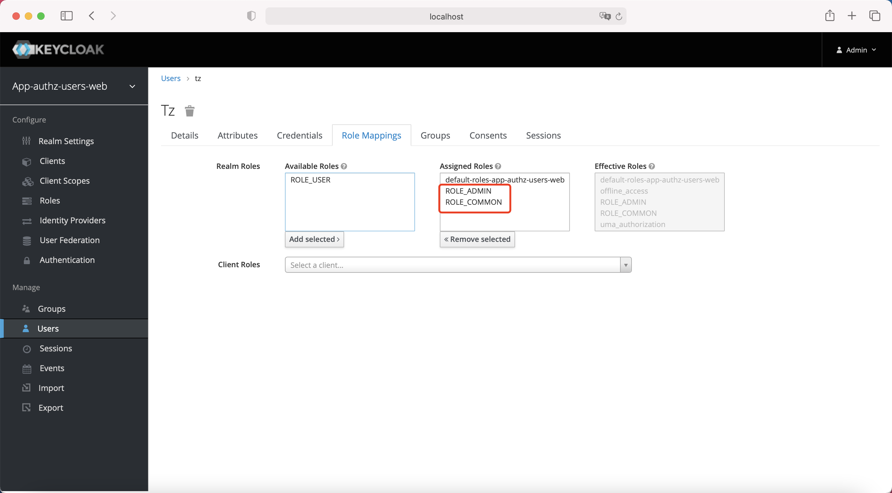

#### 创建client

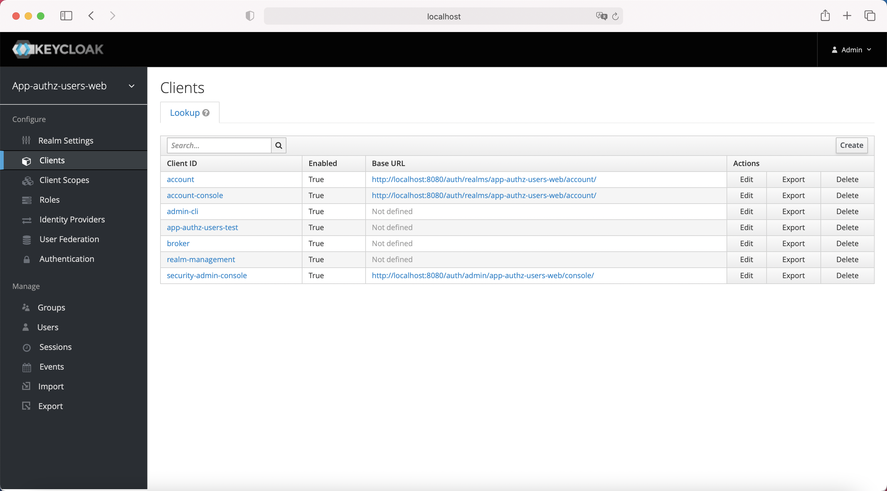

#### client 配置
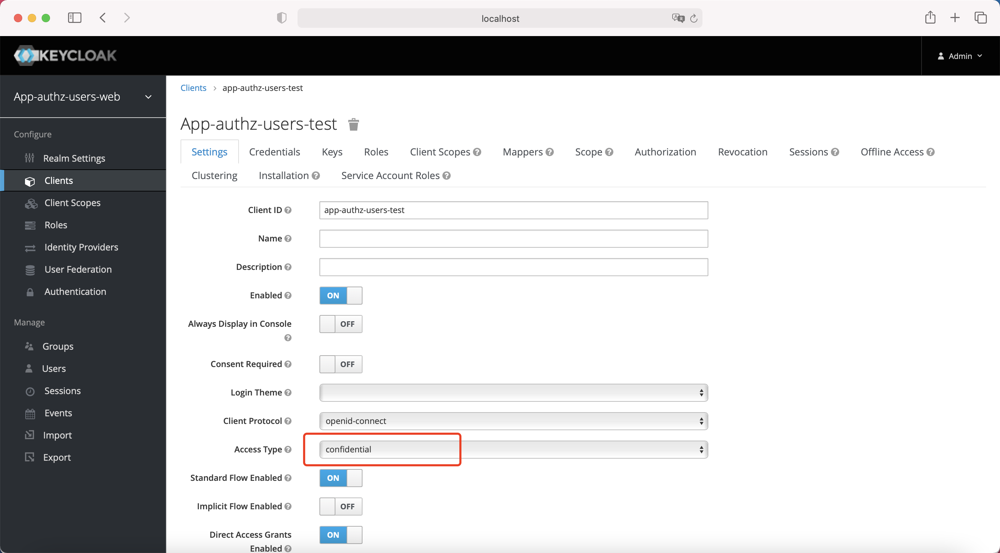
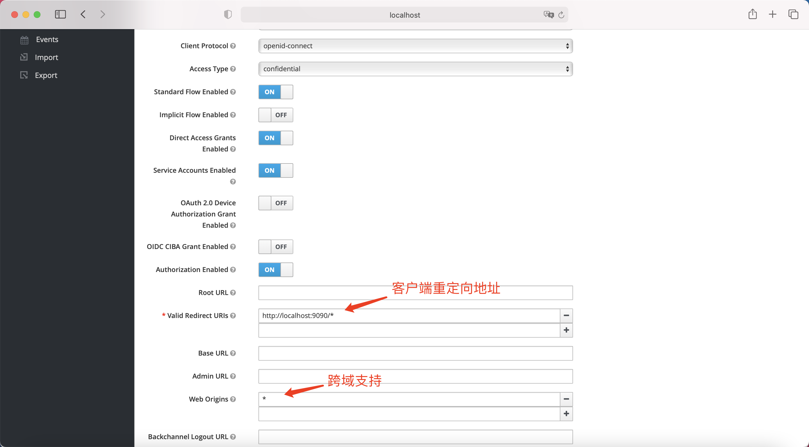

#### client authorization

- Affirmative 意味着至少有一个权限必须评估为肯定决定，才能授予对资源及其作用域的访问权
- Unanimous 所有的许可必须评估为一个积极的决定，以便最终决定也是积极的
- Consensus 积极决策的数量必须大于消极决策的数量。如果积极的决定和消极的决定的数量相同，
  那么最终的决定将是消极的。

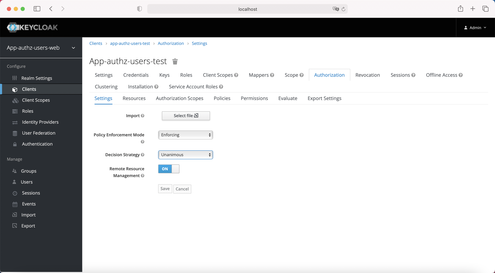

###### 创建范围
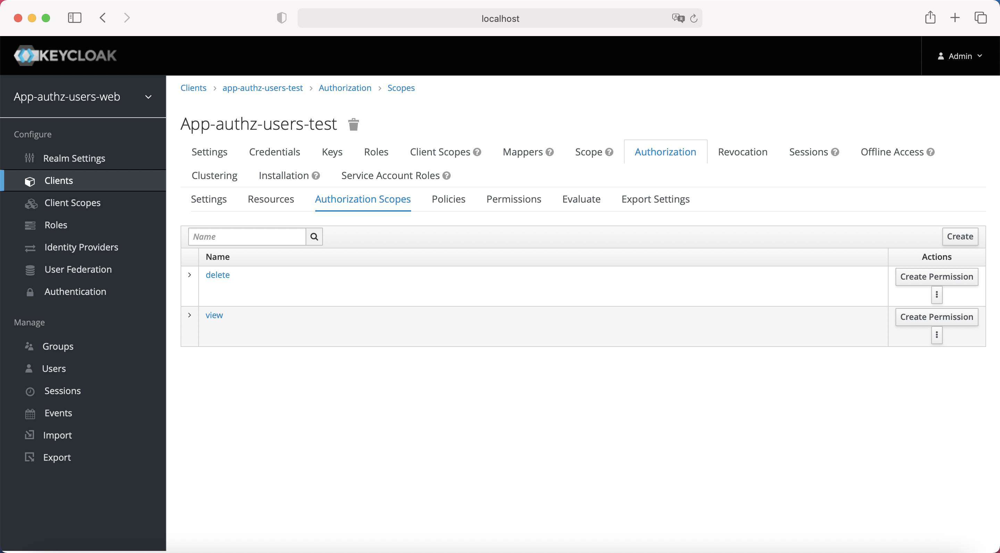

###### 创建资源
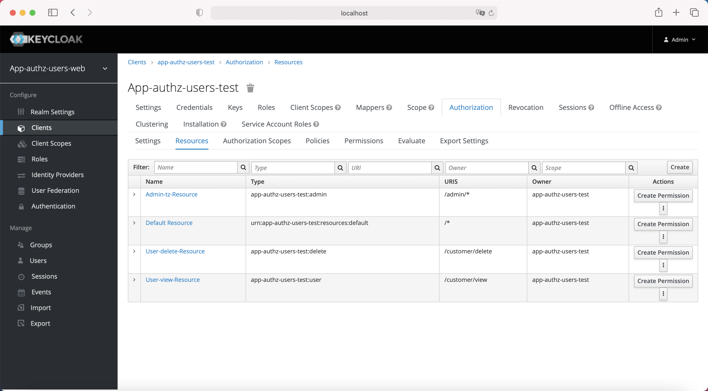

###### 创建策略
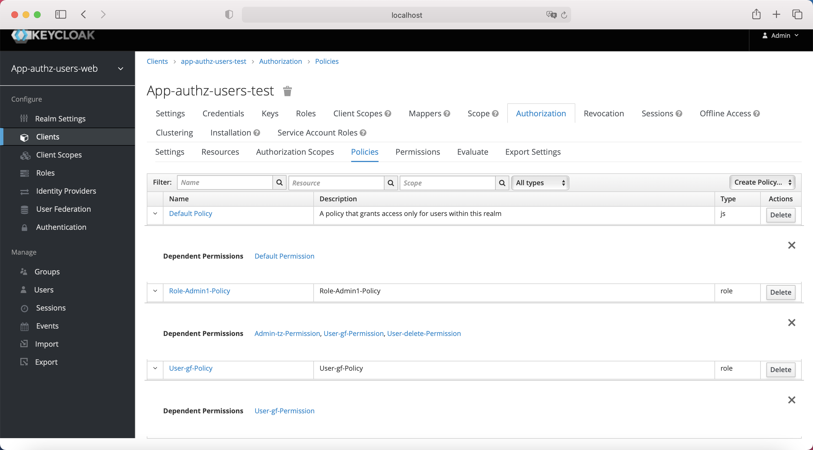

###### 把资源与策略关联形成权限
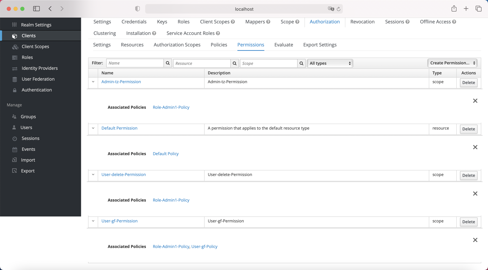

- 这里必须选择肯定的，只要有一个策略满足条件则有权限访问
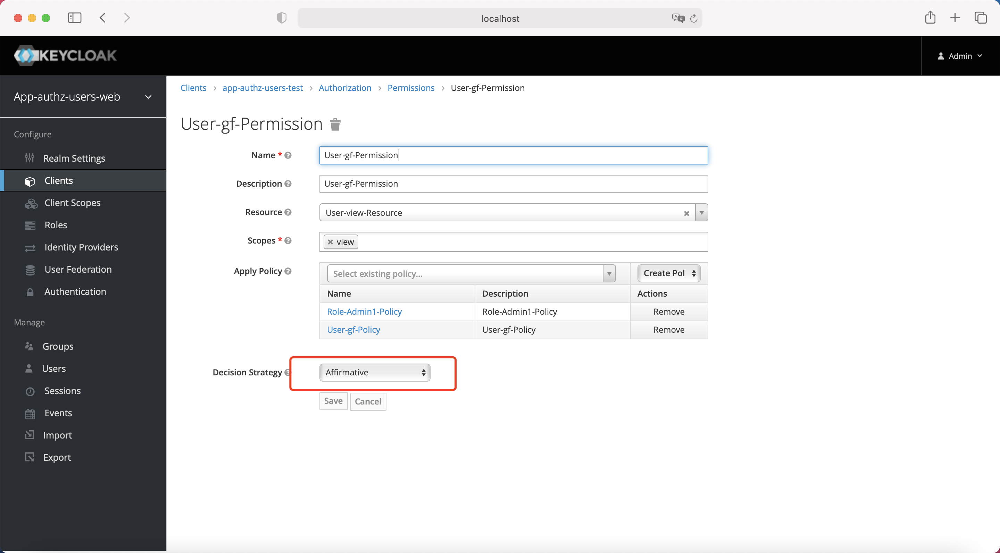
  
#### springboot应用客户端配置
```yaml
keycloak:
  auth-server-url: http://localhost:8080/auth
  # realm
  realm: app-authz-users-web
  ssl-required: external
  # clientId
  resource: app-authz-users-test
  credentials:
    secret: 6b4c5528-5d9c-48ff-9991-00dc17f7e0eb
  use-resource-role-mappings: false
  bearer-only: false
  autodetect-bearer-only: false
  # 安全约束
  security-constraints:
    - authRoles:
        - ROLE_COMMON
      security-collections:
        - patterns:
            - "/*"
  policy-enforcer-config:
    on-deny-redirect-to: /accessDenied
```
