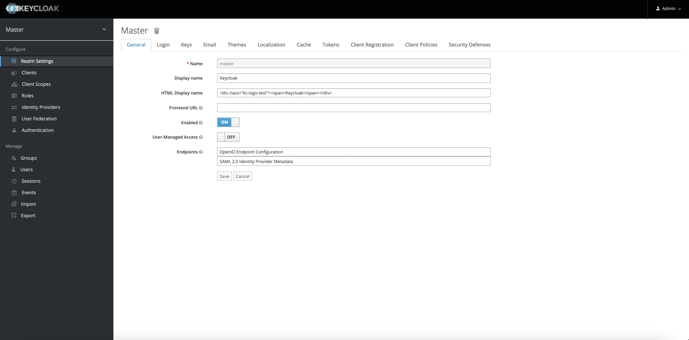
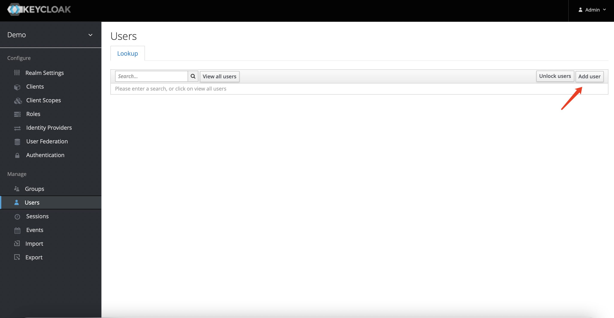
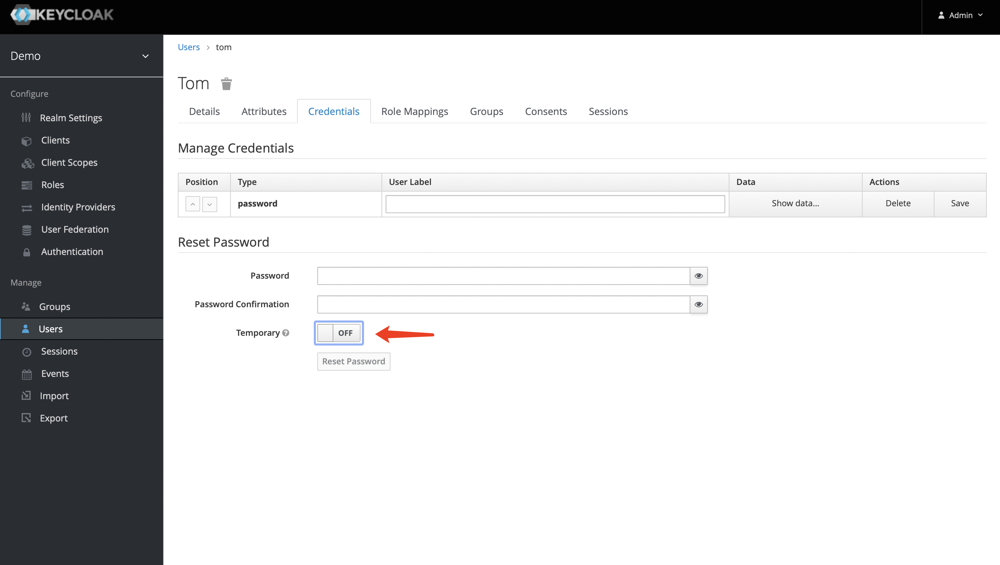

# 安装
```text
https://github.com/keycloak/keycloak-containers/tree/master/docker-compose-examples
下载需要的docker-compose文件
```

## keycloak-postgres.yaml
```text
version: '3'

volumes:
  postgres_data:
      driver: local

services:
  postgres:
      image: postgres
      volumes:
        - postgres_data:/var/lib/postgresql/data
      environment:
        POSTGRES_DB: keycloak
        POSTGRES_USER: keycloak
        POSTGRES_PASSWORD: password
  keycloak:
      image: quay.io/keycloak/keycloak:latest
      environment:
        DB_VENDOR: POSTGRES
        DB_ADDR: postgres
        DB_DATABASE: keycloak
        DB_USER: keycloak
        DB_SCHEMA: public
        DB_PASSWORD: password
        KEYCLOAK_USER: admin
        KEYCLOAK_PASSWORD: Pa55w0rd
        # Uncomment the line below if you want to specify JDBC parameters. The parameter below is just an example, and it shouldn't be used in production without knowledge. It is highly recommended that you read the PostgreSQL JDBC driver documentation in order to use it.
        #JDBC_PARAMS: "ssl=true"
      ports:
        - 8080:8080
      depends_on:
        - postgres
```

> 官网目前不支持arm64架构，需要自己编译image

```shell
#/bin/zsh

VERSION=15.0.2 # set version here

git clone https://github.com/keycloak/keycloak-containers.git
cd keycloak-containers/server
git checkout $VERSION
docker build -t "jboss/keycloak:${VERSION}" .
docker build -t "quay.io/keycloak/keycloak:${VERSION}" .
```

## docker-compose命令
```shell
后台启动
docker-compose -f keycloak-postgres.yaml -d
单独启动服务
docker-compose -f keycloak-postgres.yaml start postgres keycloak
```

## 访问
http://localhost:8080/auth


## 创建Realm
```text
Realm字面意思是领域，指的是在某一个软件业务领域中所涉及的用户认证授权管理相关的对象，
在这个realm下有用户、角色、会话（session）等等用于认证授权管理的对象。
```
### 步骤

- 用admin账户登录http://localhost:8080/auth/admin/
- 从Select Realm菜单点Add Realm，创建一个叫demo点realm


## 创建一个角色
### 步骤

- 点左侧菜单Users

  
- 填写Username必填字段，其他默认，点保存
- 在Credentials tab页，重置密码，temporary设置为off

  
## 登录账户控制台

### 步骤
- 登录http://localhost:8080/auth/realms/demo/account 


